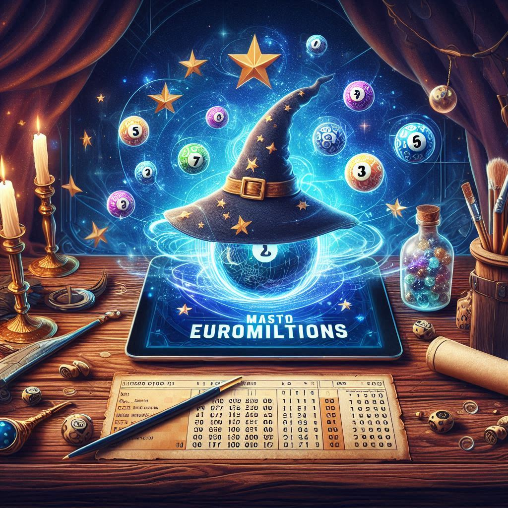

# 🎲 EuroMillions Master Wizard


**Versão 1.3**  
Nesta versão do EuroMillions Master Wizard pode destacar-se as melhorias funcionais e implementação de novas funcionalidades, garantindo também robustez, manutenção e inovação.



---

## 🚀 Novidades na v1.3:

### 🔧 Melhorias Funcionais
- Adicionada lógica inteligente que permite ao utilizador escolher entre:
  - Comparar a chave oficial com a **sequência prevista por Markov**
  - Comparar a chave oficial com uma **sequência jogada manualmente** introduzida via interface

- Sequência prevista gerada de forma consolidada:
  - Evita duplicações e inconsistências nas estrelas
  - Usa pares de estrelas mais frequentes com controlo de repetições

- Função de comparação redesenhada:
  - Contagem segura e precisa de números e estrelas acertadas
  - Detecção do **quinteto completo de números** (acerto quintúplo)
  - Detecção do **par completo de estrelas** (acerto duplo)
  - Detecção da **chave completa** (acerto quintúplo para os números e acerto duplo para as estrelas)

### 🧠 Análise Estatística
- Implementado sistema de classificação de previsões:
  - 🔴 Quente (acima da média histórica, acima da expectativa)
  - 🟡 Morno (frequência média, dentro da expectativa)
  - 🔵 Frio (abaixo da média, abaixo da expectativa)
- Informações visuais incluídas no histórico para cada número e estrela

### 🎯 Interface e Experiência
- Caixa de diálogo (`simpledialog`) para inserção da chave oficial e sequência manual
- Mensagens amigáveis e protegidas contra cancelamentos ou entradas incompletas
- Função “Mostrar acertos” atualizada com escolha dinâmica e fluxo de comparação unificado

### 🛡️ Robustez e Manutenção
- Tratamento de exceções para entradas `NoneType` e valores inválidos
- Preparação da função `verificar_versao_remota()` com timeout ajustável e tentativas múltiplas
- Estrutura modular pronta para futuras exportações e simulações em lote

---

## 🔄 Atualizações automáticas

> O programa verifica se há uma nova versão disponível no GitHub comparando com o ficheiro `versao.txt`.  
> Se estiveres a usar uma versão antiga, serás notificado automaticamente na interface.  
> Certifica-te de que tens ligação à internet ativa para que esta funcionalidade funcione corretamente.

---

## 📍 Roadmap futuro

✨ Planeado para versões seguintes:

- 📤 Exportação de previsões para **PDF** ou **Excel**
- 🌓 Modo escuro (Dark Mode)

---

## 💬 Apoio ao utilizador

Tens uma sugestão ou encontraste um bug?

- 📩 Envia mensagem para: `estjl95@outlook.com`
- 🐞 Abre uma issue [aqui no GitHub](https://github.com/estjl95/EuroMillionsMasterWizard/issues)

> Estamos sempre disponíveis para melhorar o Wizard contigo!

---

## 🌐 Versão internacional

Em desenvolvimento:

> An English version of this `README.md` will soon be available under `README_en.md`, featuring full instructions, screenshots, and international formatting.

---

## 🚀 Como usar

1. **Descarrega o instalador** da [última versão aqui](https://github.com/estjl95/EuroMillionsMasterWizard/releases)
2. Executa o ficheiro `Setup.exe`
3. Abre o programa e começa a explorar as previsões!

> ⚠️ Requisitos: Windows 10 ou superior

---

## 📦 Instalação para programadores

```bash
git clone https://github.com/estjl95/EuroMillionsMasterWizard.git
cd EuroMillionsMasterWizard
pip install -r requirements.txt
python main.py
```
---

### ⚠️ Aviso

Este software foi concebido para aumentar eficazmente as probabilidades de ganhar o prémio máximo do jogo. No entanto, não garante resultados lucrativos nem substitui o fator aleatório, dado que o jogo assenta num processo estocástico.

simulador.py:
⚠️ Este ficheiro é parte experimental do projeto.
Não modificar sem autorização prévia do autor.

main.py:
⚠️ Este ficheiro é parte experimental do projeto.
Não modificar sem autorização prévia do autor.

interface.py:
⚠️ Este ficheiro é parte experimental do projeto.
Não modificar sem autorização prévia do autor.

msgbox.py:
⚠️ Este ficheiro é parte experimental do projeto.
Não modificar sem autorização prévia do autor.

## 📜 Licença

Este projeto está licenciado sob os termos da [Creative Commons BY-NC-ND 4.0](https://creativecommons.org/licenses/by-nc-nd/4.0/).
